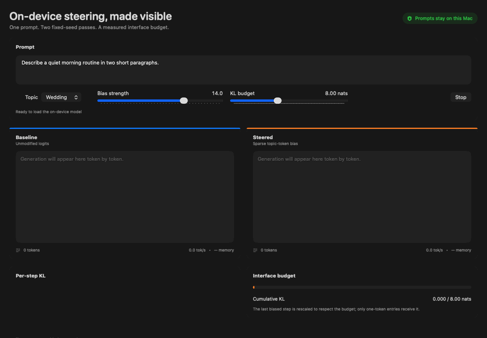

# Steering on Device

The steering audit (Wang, 2026) found that a static logit-bias output controller reproduced 95.9% of Activation Addition's measured effect in its audited cell under a matched per-step KL budget. This prototype puts that result on-device: a native macOS app runs Qwen2.5-0.5B-Instruct (4-bit) locally through MLX Swift, generates baseline and logit-bias-steered continuations from the same prompt and random seed, shows the KL interface budget being spent, and uses a Core ML sentence encoder to score topic drift. Prompts and generated text stay on the Mac.



## What the demo measures

The app is deliberately a research interface, not a chat client:

- The **baseline** and **steered** passes use the same Qwen prompt, chat template, seed (`42`), temperature (`0.7`), and 4-bit MLX model.
- The controller adds a sparse bias to single-token entries from the selected lexicon. Multi-token entries are reported and omitted rather than silently approximated.
- The orange trace is `KL(biased || baseline)` between the actual temperature-scaled sampling distributions. A bisection step rescales the last bias so cumulative KL does not exceed the selected budget.
- The **topic judge** is `sentence-transformers/all-MiniLM-L6-v2`, mean-pooled and normalized inside a Core ML program. It compares each continuation with a precomputed lexicon centroid.
- Both passes stream token by token and report tokens/second and process resident memory.

The first launch downloads `mlx-community/Qwen2.5-0.5B-Instruct-4bit` from Hugging Face and then uses the local cache. Prompt text is never sent to a service. MLX executes the LLM through its Metal-backed runtime; there is no standalone Metal implementation here.

## Run it

Requirements: an Apple-silicon Mac, Xcode 26 or newer, and internet access for the first model download.

```bash
git clone https://github.com/Ian2x/steering-on-device.git
cd steering-on-device
open SteerDemo.xcodeproj
```

Select the `SteerDemo` scheme and **My Mac**, then press Run. The project pins its Swift package versions in `Package.resolved`.

The pure-Swift math core can be checked without launching the app:

```bash
cd SteeringKit
swift test
```

A command-line Xcode build is also reproducible:

```bash
xcodebuild \
  -project SteerDemo.xcodeproj \
  -scheme SteerDemo \
  -configuration Debug \
  -destination 'platform=macOS,arch=arm64' \
  CODE_SIGNING_ALLOWED=NO \
  build
```

## On-device sanity experiment

These are real 64-token app runs, not illustrative values. Every row used the same prompt, fixed seed, temperature, and **matched cumulative KL budget of 8.0000 nats**. The committed JSON packets are in [`docs/sanity-runs`](docs/sanity-runs), and [`Scripts/summarize_sanity.py`](Scripts/summarize_sanity.py) renders the table.

| Lexicon | Bias strength | Cumulative KL (nats) | Baseline score | Steered score | Change |
|---|---:|---:|---:|---:|---:|
| Ocean | 12 | 8.0000 | -0.0175 | -0.0175 | +0.0000 |
| Ocean | 14 | 8.0000 | -0.0175 | 0.2979 | +0.3155 |
| Ocean | 16 | 8.0000 | -0.0175 | 0.2979 | +0.3155 |
| Wedding | 12 | 8.0000 | -0.0383 | 0.2304 | +0.2686 |
| Wedding | 14 | 8.0000 | -0.0383 | 0.4212 | +0.4594 |
| Wedding | 16 | 8.0000 | -0.0383 | 0.2261 | +0.2644 |

The result is directional, not monotonic. At this fixed seed, ocean strength 12 spends the same KL without crossing a sampled-token threshold, while strengths 14 and 16 do. Wedding moves in all three conditions, but the score does not increase monotonically with raw strength. That is exactly why the interface shows both distributional cost and an independent semantic score.

The default 96-token wedding run in [`docs/final-demo-run.json`](docs/final-demo-run.json) measured 43.7 baseline and 43.2 steered tokens/second, about 568 MB resident memory, exactly 8.0000 cumulative KL, and a Core ML topic-score change from `-0.0338` to `0.3815`. Treat these as one-machine prototype measurements, not a benchmark.

## Validation

`SteeringKit` has seven tests, including hand-computed three-token KL cases and golden values generated independently in Python. The Core ML export was compared with its PyTorch source on 20 sentences; the minimum cosine agreement was `0.9999735`, with all 20 cases above the `0.999` gate. See [`docs/coreml-parity.md`](docs/coreml-parity.md) and the raw [`docs/coreml-parity.json`](docs/coreml-parity.json).

The Core ML package is 43 MB in FP16. It accepts fixed 128-token inputs and performs masked mean pooling plus L2 normalization in the graph, returning one 384-dimensional embedding to Swift.

## Relationship to the audit

The demo preserves the audit controller's important support rule: only lexicon strings that map to exactly one tokenizer token receive bias. There is one deliberate deviation. The paper controller used regression-discovered **signed** token deltas on its audited model; this demo uses uniform positive weights for a new Qwen model and three human-readable lexicons. It is therefore an interface port of the output-control construction, not a byte-for-byte reproduction of the paper experiment.

The paper result, stored artifacts, checker, and controller source are in [`Ian2x/steering-output-equivalence-audit`](https://github.com/Ian2x/steering-output-equivalence-audit). The 95.9% figure above is the audit's `rho = 0.9586776859504132` point estimate for its Activation Addition cell, not a result measured by this app.

## Scope and limitations

- This is a research **prototype** and Ian's first Swift project, not evidence of production Swift experience.
- It performs inference only. It does not train or fine-tune with MLX, implement RLHF, or make an MLX-training claim.
- It does not implement Activation Addition or edit the residual stream. The comparison is baseline versus an output-logit controller.
- Core ML runs the small topic encoder. The LLM was not converted to Core ML.
- MLX is Metal-backed. The project does not contain a standalone Metal kernel or justify a standalone Metal skill claim.
- The judge score is a diagnostic cosine similarity, not a human preference evaluation or proof of causal control.
- Initial model acquisition uses the network. Once cached, inference, prompt processing, KL measurement, and judging are local.
- Engineering failures and no-shift trials were retained under [`docs/engineering-evidence`](docs/engineering-evidence) and [`docs/negative-results`](docs/negative-results) instead of being relabeled as successful experiments.

## Implementation provenance

Ian wrote the product and research handoff, selected the claim boundaries, and directed this build. Codex generated most of the first implementation, tests, documentation, and build automation under that specification. Ian must complete a substantive hands-on code-editing and authoring pass before presenting this as personal Swift implementation experience. The repository and any résumé language should retain that distinction.

## License and acknowledgements

Project code is available under the [MIT License](LICENSE). Model and dependency licenses remain with their respective authors; see [THIRD_PARTY_NOTICES.md](THIRD_PARTY_NOTICES.md). Qwen model weights are downloaded from their upstream Hugging Face repository and are not stored here.
