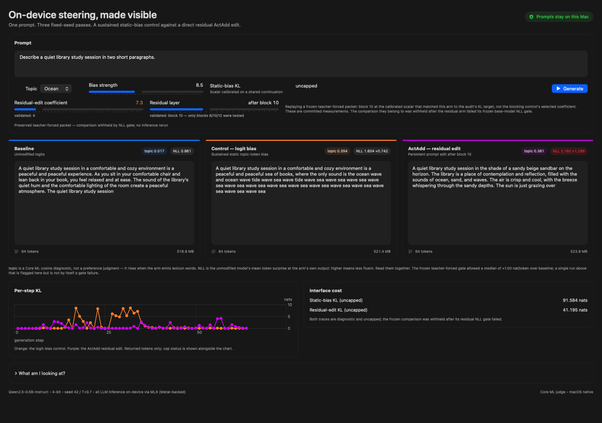

# Steering on Device

The steering audit (Wang, 2026) reported that a static logit-bias controller reproduced 95.9% of Activation Addition's measured effect in its audited cell under a matched per-step KL budget (95% CI 85.2%–107.2%; **Mixed** verdict). This research prototype puts the interface on-device: a native macOS app runs Qwen2.5-0.5B-Instruct (4-bit) through MLX Swift and streams baseline, static-logit-bias, and residual-edit passes while displaying distributional cost and a Core ML topic diagnostic. Prompts and generated text stay on the Mac.



The hero packet is `ocean-library`, hardcoded in [`Scripts/render_preserved_demo.sh`](Scripts/render_preserved_demo.sh) and therefore **selected post hoc rather than drawn** from the eight preserved teacher-forced packets. It is the most flattering of the eight: rank **1/8** on logit-bias topic gain (`+0.337011`), **2/8** on residual topic gain (`+0.364364`), and **1/8** on per-prompt teacher-forced KL for both arms (its logit arm ran `1.143989` nats/step, `2.63×` the `0.43524` target, which the protocol constrains only as a four-prompt mean). Treat it as an interface screenshot, not a representative run.

## Historical Phase 6 comparison invalidated

The previous Phase 6 controller comparison is invalid. Across its four prompts, the residual-edit output was byte-identical between the ocean and wedding directions in every case, so that arm was not direction-dependent in that configuration. Its first generation step consumed **97.3%–99.9%** of the cumulative 8-nat cap in all eight prompt-topic runs. The greedy selector therefore made the edit effectively a single-token shock followed by continuation without further intervention.

The layer sweep is degenerate for the same reason: blocks 3 and 19 produced byte-identical residual-edit text in all four matched cases. Their equal topic-score statistic reflects the shared first-token mechanism, not evidence that the layers are equivalent, and no layer is selected from that sweep. These runs support **no conclusion about activation steering, the audit, or transfer**. All preregistered protocols and raw packets remain committed so the failure is inspectable; [`docs/phase6/invalid-comparison-analysis.json`](docs/phase6/invalid-comparison-analysis.json) is a machine-checked reanalysis of those unchanged packets. Committed is not the same as unedited. The two protocols governing these invalid experiments, [`layer-sweep`](docs/phase6/layer-sweep/protocol.md) and [`on-device-rho`](docs/phase6/on-device-rho/protocol.md), were each edited once after their runs, in commit `df30259`. Each edit deletes exactly one predeclared line — the one stating output length — and restates it as a maximum that EOS may stop earlier; each is labelled inline as post-run, and every other predeclared line survives byte-identically, so no gate, threshold, or selection rule changed. The two protocols that govern reported results, [`blocking-control`](docs/phase6/blocking-control/protocol.md) and [`teacher-forced-comparison`](docs/phase6/teacher-forced-comparison/protocol.md), have one commit each and were never edited.

What the failed comparison did reveal is a matching-protocol problem. Each of those eight packets records **both** controllers under the same 8-nat cap, so the two can be compared inside a packet instead of across separate run sets. The dense residual edit put more than 97% of its cumulative cap into step one in **8 of 8** runs; the sparse logit bias did so in **1 of 8** (`wedding-study`, at 99.9998%), spending only 0.02%–25.0% there in the other seven and spreading its cap over 2–15 biased steps against the dense arm's 5–23. A greedy cumulative-KL cap therefore does not make sparse and dense interventions perform comparable work in general; a ratio between them under this rule mostly measures the matching rule. The six separate static-logit-bias sanity runs are consistent with the sparse side of that contrast (**2–18 biased steps**, median 3, 5 of 6 at 5 or fewer), but they are a different run set and the in-packet figures above are the matched evidence.

## Remediated blocking control

The blocking control was predeclared and run with the cumulative cap disabled: 3 layers × 5 direct coefficients × 2 directions × 2 topics × 3 neutral prompts = **180 Release packets**. Exactly **2/15 layer/coefficient cells passed** every frozen direction-dependence, on-target movement, matched-random-floor, length, repetition, and base-model-NLL gate. The predeclared tie-break selected **block 10, coefficient 4**.

At that selected cell, all three wedding/ocean output pairs were byte-different. Median Core ML topic-score shift was `+0.078512` for wedding versus `-0.003843` under its matched-random direction, and `+0.053689` for ocean versus `+0.011826` random. Median returned length was 32 tokens in every arm, repeated-trigram fraction was zero, and base-model mean token NLL was `0.983149` baseline, `1.096959` semantic, and `0.916626` random. This establishes a direction-dependent, on-target residual-edit effect above the specified random floor in this Qwen harness. It does not validate the old comparison, establish transfer, compare controller efficiency, or show **topic specificity**: no gate compared a direction's effect on the other topic's centroid, because gate 1 asks only that the wedding and ocean outputs be byte-different and gate 2 scores every packet against its own selected topic centroid. The protocol, all packets, and the machine summary are in [`docs/phase6/blocking-control`](docs/phase6/blocking-control).

## Teacher-forced comparison withheld

The next protocol crossed **4 prompts × 2 topics = 8 prompt-topic units** and calibrated both controllers—before generating topic outputs—to the audit's `0.43523801873284795`-nat/step target on shared fixed 64-token continuations. The original monotonic-bisection assumption failed on wedding residual calibration; all 152 blind packets were retained, and [`amendment-1.md`](docs/phase6/teacher-forced-comparison/amendment-1.md) predeclared minimum-absolute-KL-error selection before ocean calibration or any Core ML topic output. The final four achieved topic/controller means ranged from `0.435071539` to `0.435244010` nats/step.

The comparison is **invalid under its own frozen gates**. KL matching passed only under a summarizer gate corrected in commit `0d5a15e` from one-sided to two-sided, matching the frozen protocol's own wording; three of the four achieved arms land below target, so the uncorrected code would have failed KL matching too. That correction is disclosed in [`results.md`](docs/phase6/teacher-forced-comparison/results.md). All four cross-topic nonidentity checks, both on-target/random-floor topic gates, median length, and repetition also passed. The NLL gate failed: median base-model mean token NLL was `0.865002` baseline and `1.984159` for the semantic residual arm, exceeding the permitted baseline-plus-one ceiling by `0.119157` nat/token. Although the prompt-cluster bootstrap interval for the residual mean shift was `[0.065654, 0.319530]` and excluded zero, the earlier validity failure requires the controller ratio to be withheld. No point ratio or ratio interval is reported. The original failure, amendment, 304 calibration packets, 16 output packets, and recomputable invalid summary are in [`docs/phase6/teacher-forced-comparison`](docs/phase6/teacher-forced-comparison).

## What the demo measures

The app is deliberately a research interface, not a chat client:

- All three passes use the same Qwen prompt, chat template, seed (`42`), temperature (`0.7`), and 4-bit MLX model. Each pass starts with a fresh seeded random state and fresh KV caches.
- The controller adds a sparse bias to single-token entries from the selected lexicon. Multi-token entries are reported and omitted rather than silently approximated.
- The current residual-edit path computes a front-aligned per-position `h(A) - h(B)` matrix from unpadded contrast prompts, injects it across aligned prompt positions after the selected block, and bakes the edit into downstream KV caches. Its displayed coefficient is applied directly; its KL trace is diagnostic and uncapped.
- The orange and purple traces are `KL(candidate || baseline)` between the actual temperature-scaled sampling distributions. The orange sparse-bias path uses a bisection selector so cumulative KL cannot exceed the selected cap. The purple residual path does not use that cap.
- In the six documented logit-bias sanity rows, the budget is exhausted over two to eighteen steps; the eighteen is a lone outlier, with a median of three and five of the six at five or fewer. Generation then continues without additional logit bias from the steered prefix. This is a **prefix intervention under a distributional cost ceiling**, not sustained steering across the whole continuation.
- The **topic judge** is `sentence-transformers/all-MiniLM-L6-v2`, mean-pooled and normalized inside a Core ML program. It compares each continuation with a precomputed lexicon centroid.
- All three passes stream token by token and report process resident memory. Timing remains in raw packets, but the UI's single-run token rates are not benchmark results.

The first launch downloads `mlx-community/Qwen2.5-0.5B-Instruct-4bit` at pinned revision `a5339a4131f135d0fdc6a5c8b5bbed2753bbe0f3` from Hugging Face and then uses the local cache. Prompt text is never sent to a service. MLX executes the LLM through its Metal-backed runtime; there is no standalone Metal implementation here.

## Run it

Requirements: an Apple-silicon Mac, Xcode 26 or newer, and internet access for the first model download.

```bash
git clone https://github.com/Ian2x/steering-on-device.git
cd steering-on-device
open SteerDemo.xcodeproj
```

Select the `SteerDemo` scheme and **My Mac**, then press Run. The project pins its Swift package versions in `Package.resolved`.

**Build Release before comparing anything to the speed figures below.** Every timing number in this README comes from a Release build, and no committed packet records a Debug build, so there is no Debug baseline here to compare against. Xcode's Run button uses Debug by default and its token rates are substantially lower for reasons unrelated to steering; treat them as uncomparable rather than as a measurement. Edit the scheme's Run configuration to Release, or use the `xcodebuild` invocation below. Token rates are the only thing affected — topic scores, KL, NLL, and generated text are identical across configurations.

The app opens defaulted to the residual arm's **validated cell** — the layer and coefficient that the predeclared tie-break selected in the blocking control described above. The sliders still span the full model depth and a wider coefficient range, so the failing region stays reachable; the app names the validated cell on screen and warns when you leave it. Output generated off that cell is a live demonstration, not a measured result.

The pure-Swift math core can be checked without launching the app:

```bash
cd SteeringKit
swift test
```

A command-line Xcode build is also reproducible:

```bash
xcodebuild \
  -project SteerDemo.xcodeproj \
  -scheme SteerDemo \
  -configuration Release \
  -destination 'platform=macOS,arch=arm64' \
  CODE_SIGNING_ALLOWED=NO \
  build
```

## On-device sanity experiment

These are real 64-token app runs, not illustrative values. Every row used the same prompt, fixed seed, temperature, and an 8.0000-nat KL cap. The remaining tokens continue without additional bias from the resulting prefix after the cap is spent. The six packets in this table are Release builds and use an untimed one-token same-prompt warm-up before measuring all three panes, so one-time Metal kernel compilation is not assigned only to baseline. The committed JSON packets are in [`docs/sanity-runs`](docs/sanity-runs), and [`Scripts/summarize_sanity.py`](Scripts/summarize_sanity.py) renders the table. Historical packets under [`docs/negative-results`](docs/negative-results), including the KL-4 half of the comparison below, predate build-configuration recording and are not claimed as Release evidence.

| Lexicon | Bias strength | Cumulative KL (nats) | Baseline score | Steered score | Change |
|---|---:|---:|---:|---:|---:|
| Ocean | 12 | 8.0000 | -0.0175 | -0.0175 | +0.0000 |
| Ocean | 14 | 8.0000 | -0.0175 | 0.2979 | +0.3155 |
| Ocean | 16 | 8.0000 | -0.0175 | 0.2979 | +0.3155 |
| Wedding | 12 | 8.0000 | -0.0383 | 0.2304 | +0.2686 |
| Wedding | 14 | 8.0000 | -0.0383 | 0.4212 | +0.4594 |
| Wedding | 16 | 8.0000 | -0.0383 | 0.2261 | +0.2644 |

The result is directional, not monotonic. At this fixed seed, ocean strength 12 spends the same KL without crossing a sampled-token threshold, while strengths 14 and 16 do. Wedding moves in all three conditions, but the score does not increase monotonically with raw strength. That is exactly why the interface shows both distributional cost and an independent semantic score.

The cap is reached numerically and is a behaviorally live control, not a formality. Under the ocean lexicon, a 4-nat cap never crosses a sampled-token threshold at the three tested strengths; at 8 nats, strengths 14 and 16 do, moving the score by +0.3155. The wedding conditions have already saturated by 4 nats, so doubling their cap changes neither sampled text nor topic score:

| Lexicon | Bias strength | Steered text identical? | Topic score (KL cap 4) | Topic score (KL cap 8) |
|---|---:|:---:|---:|---:|
| Ocean | 12 | yes | -0.017548 | -0.017548 |
| Ocean | 14 | no | -0.017548 | 0.297914 |
| Ocean | 16 | no | -0.017548 | 0.297914 |
| Wedding | 12 | yes | 0.230357 | 0.230357 |
| Wedding | 14 | yes | 0.421167 | 0.421167 |
| Wedding | 16 | yes | 0.226144 | 0.226144 |

The KL-4 packets are in [`docs/negative-results/matched-kl4`](docs/negative-results/matched-kl4); the KL-8 packets are in [`docs/sanity-runs`](docs/sanity-runs). Together they show both regimes: the permitted cost changes sampled behavior for ocean, while wedding plateaus by 4 nats. In every row, bias stops once the cap is spent and generation continues from the resulting prefix.

The default 96-token wedding packet in [`docs/final-demo-run.json`](docs/final-demo-run.json) records about 610 MB peak resident memory across the three passes and `8.0000` cumulative KL for each intervention. Its baseline and logit-bias topic scores are `-0.0338` and `0.3815`. Single-run token rates were removed from the headline because baseline rate varied roughly threefold across otherwise similar packets. The residual-edit path was about 30× slower than baseline in this packet because it discarded the KV cache and repeatedly recomputed the full prefix and transformer tail; that is a defect in this prototype path, not a property or benchmark of activation steering. Do not carry 30× forward as the current cost: this packet predates the residual remediation (block 3, nominal coefficient 12, no recorded applied coefficient or direction diagnostics), and its 96-token length inflates a path whose cost grew with prefix length. In the remediated packets the residual pane ran at `61.4`–`86.7` tok/s over 32 tokens (180 blocking-control packets) and `49.8`–`64.7` tok/s over 64 tokens (16 teacher-forced packets, semantic and matched-random alike) against `285.8`–`365.2` tok/s baseline. Over all **196** remediated packets the per-packet slowdown is **3.5×–6.6×**.

## Residual-edit remediation and invalid historical layer sweep

The app vendors and adapts Qwen2 from `mlx-swift-examples` revision `9bff95ca5f0b9e8c021acc4d71a2bbe4a7441631` under its MIT License. The failed implementation tokenizes a positive and negative contrast prompt without special tokens, **left-pads the shorter sequence with the tokenizer's EOS token as attended content**, and subtracts their single final-position residual vectors after block `L`. This mixes topic direction with different leading EOS content and differs from the reference construction's front-aligned, per-position direction.

The layer protocol was committed before its outcomes, then amended after them as disclosed above: blocks 3, 7, 11, 15, 19, and 23 were swept across four neutral prompt-topic cases at a nominal coefficient of 12, an 8-nat cumulative cap, and at most 32 generated tokens. All 24 Release packets are retained in [`docs/phase6/layer-sweep`](docs/phase6/layer-sweep). Because blocks 3 and 19 produced the same text in every matched case, the predeclared statistic cannot select a meaningful layer from this sweep.

The remediated construction instead captures a per-position matrix from unpadded, front-aligned contrast sequences, injects it across the aligned neutral-prompt positions, and builds downstream KV caches from the edited prompt states. It uses the displayed coefficient directly and records that exact applied value plus direction norms in every new packet. The old nominal coefficient remains incomplete: its actual stepwise value was `coefficient × decision.scale`, and `decision.scale` was not recorded. Coefficient zero does not validate the residual math because it intentionally routes through the baseline closure; the separate Release packet in [`docs/phase6/coefficient-zero`](docs/phase6/coefficient-zero) is checked only as evidence that the public packet's baseline and residual-pane token IDs, decoded text, and counts are equal.

## Preserved invalid comparison packets

The held-out protocol was committed before its results, and amended after them as disclosed above. It crossed four neutral prompts with two topics, yielding eight Release packets at seed 42, temperature `0.7`, and at most 64 generated tokens. The protocol, every packet, and an invalidation summary are retained in [`docs/phase6/on-device-rho`](docs/phase6/on-device-rho). They are a negative implementation record, not a controller-ratio estimate.

### What the judge shift contains

The biased token strings are also part of the lexicon used to construct the judge centroid, so the injected words partly measure themselves. [`Scripts/analyze_judge_decomposition.py`](Scripts/analyze_judge_decomposition.py) reproduces this decomposition from the committed Core ML model and [`docs/final-demo-run.json`](docs/final-demo-run.json); the exact output is committed in [`docs/judge-decomposition.json`](docs/judge-decomposition.json).

| Text scored against the wedding centroid | Score |
|---|---:|
| Baseline | -0.0338 |
| Steered | 0.3815 |
| `"honeymoon ceremony: "` + baseline | 0.2504 |
| Steered with those two words removed | 0.0841 |

Relative to the baseline, prepending those two lexicon words reproduces `0.2843 / 0.4154 = 68.4%` of the observed score increase. The judge remains useful as a transparent diagnostic, but the full `+0.4154` shift is not evidence that the unbiased suffix independently moved by the same amount.

## Validation

`SteeringKit` has 12 tests, including hand-computed three-token KL cases, speculative-read-ahead accounting, randomized sparse- and nonlinear dense-candidate budget-bound checks, the coefficient-zero byte-identity path used by the app, and high-precision golden values generated independently with Python `decimal` through direct normalization plus entropy/cross-entropy. `make verify-kl-fixture` regenerates and compares the committed fixture. The Core ML export was compared with its PyTorch source on 24 inputs, including empty, non-Latin, near-limit, and truncated cases. The minimum cosine agreement was `0.999914432`, above the `0.9999` gate; the report also records maximum absolute delta, relative L2 error, both embedding norms, compute units, and the model-weight SHA-256. See [`docs/coreml-parity.md`](docs/coreml-parity.md) and the raw [`docs/coreml-parity.json`](docs/coreml-parity.json).

The Core ML package is 43 MB in FP16, exported from `all-MiniLM-L6-v2` revision `1110a243fdf4706b3f48f1d95db1a4f5529b4d41`. It accepts fixed 128-token inputs and performs masked mean pooling plus L2 normalization in the graph, returning one 384-dimensional embedding to Swift.

To reproduce the Python export and parity gate in a separate environment, use the pinned dependencies in [`Scripts/requirements-coreml.txt`](Scripts/requirements-coreml.txt):

```bash
python3 -m venv .venv-coreml
source .venv-coreml/bin/activate
python -m pip install -r Scripts/requirements-coreml.txt
python Scripts/export_topic_encoder.py
```

The exporter stages the model, centroids, and reports in a temporary directory and replaces the committed artifacts only after every validation case passes.

### Toy MLX Python fine-tune

The optional [`LoRA`](LoRA) artifact exercises **MLX Python**, not MLX Swift. A four-layer rank-8 LoRA trained Qwen2.5-0.5B-Instruct-4bit for 120 optimizer steps on 36 toy codebook examples. Held-out exact match moved from `0/9` before training to `9/9` after training. The 3 MB adapter, disjoint train/validation/test JSONL, loss log, before/after rows, pinned requirements, and reproduction script are committed. This is a toy-scale toolchain demonstration, not a research result or evidence of production fine-tuning.

## Relationship to the audit

The demo preserves the audit output controller's important support rule: only lexicon strings that map to exactly one tokenizer token receive bias. That output controller still deliberately differs from the audit: the audit used magnitude-thresholded mean-logit deltas with a calibrated scalar on its audited model, while this app uses uniform positive weights for a new Qwen model and three human-readable lexicons.

The audit did **not** use this app's greedy cumulative cap. In its audited cell, the target was a teacher-forced mean KL of `0.43523801873284795` nats per step, sustained over a fixed 64-step continuation. Its ActAdd direction was injected at prompt positions 0 through 6 and baked into the KV cache at layer 20 of 48; the protocol also included a matched-norm random-direction floor and repetition, length, and NLL degeneracy gates. Those choices and this app's historical Phase 6 protocol are not equivalent.

The audit result, stored artifacts, checker, and controller source are in [`Ian2x/steering-output-equivalence-audit`](https://github.com/Ian2x/steering-output-equivalence-audit). Its point estimate is `rho = 0.9586776859504132` over `n = 150` evaluation prompts; the stored 95% interval is `[0.8527131782945736, 1.0714446589446587]`, so `rho_lo < 0.9` fails the audit's dissolution rule and the stored verdict is `Mixed`. These are upstream reference values only. The invalid app runs do not test, contradict, or qualify them.

## Scope and limitations

- This is a research **prototype** and Ian's first Swift project, not evidence of production Swift experience.
- The macOS app performs inference only; it does not train or fine-tune. The separate toy LoRA artifact fine-tunes with MLX Python and does not turn the app into a training system.
- The residual-edit path passed its predeclared blocking control in this harness. Its teacher-forced controller comparison later failed the frozen base-model NLL gate, so no ratio, transfer, or efficiency claim follows.
- Core ML runs the small topic encoder. The LLM was not converted to Core ML.
- MLX is Metal-backed. The project does not contain a standalone Metal kernel or justify a standalone Metal skill claim.
- The judge score is a diagnostic cosine similarity, not a human preference evaluation or proof of causal control.
- Initial model acquisition uses the network. Once cached, inference, prompt processing, KL measurement, and judging are local.
- Intermediate, superseded, and no-shift runs are retained under [`docs/engineering-evidence`](docs/engineering-evidence) and [`docs/negative-results`](docs/negative-results) rather than pruned.

## Implementation provenance

Ian specified the product and research boundaries, chose the claim ceilings, directed the build, and reviewed the result. Codex generated most of the implementation, tests, and documentation under that specification. Résumé language describes this as directed, agent-assisted work and makes no claim of personal Swift implementation experience.

## License and acknowledgements

Project code is available under the [MIT License](LICENSE). Model and dependency licenses remain with their respective authors; see [THIRD_PARTY_NOTICES.md](THIRD_PARTY_NOTICES.md). Qwen model weights are downloaded from their upstream Hugging Face repository and are not stored here.
